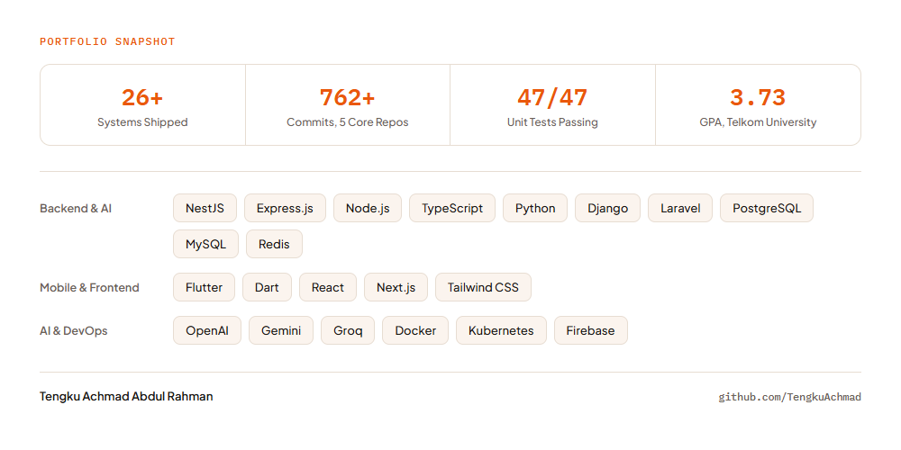

# Tengku Achmad Abdul Rahman

### Full-Stack & Mobile Engineer — AI-Integrated Systems, ISP Infrastructure, IoT

---

### About

I build production software end to end — backend APIs, web frontends, and Flutter mobile apps — for ISP, telecom, and SaaS platforms. Most of my professional work lives on my employer's internal Gitea instance and is **private by contract**, so this profile focuses on *what* I've built and *how*, rather than raw source — plus the handful of personal projects that are genuinely mine to open up.

| 26+ | 762+ | 47/47 | 3.73 |
|:---:|:---:|:---:|:---:|
| systems shipped | commits across 5 core repos | unit tests passing (CitraCore) | GPA, Telkom University |

---

### Featured Work

> Everything under **Enterprise & Client Systems** below is proprietary code I can't publish — these are honest case-study summaries, not repo links. Everything under **Personal Projects** is mine; links point to the public repos where they exist.

<b>Enterprise & Client Systems (private — summaries only)</b>

 

**CRM Backend — AI-Augmented Sales Platform** · `NestJS` `PostgreSQL` `pgvector` `BullMQ`
A CRM powering door-to-door ISP sales. 33 feature modules, RAG semantic search over 768-dim pgvector indexes, 4-provider LLM orchestration (OpenAI/Gemini/Groq/OpenRouter) with waterfall fallback, and async BullMQ integrations across ERP, HRM, and a loyalty rewards platform.

**Consumer Super App — Backend + Flutter Mobile** · `Express` `Prisma` `Flutter` `GetX`
CMS/campaign backend and companion mobile app for a multi-product consumer super app — hotel booking, crypto wallet, ISP bill pay, live CCTV, and an AI chatbot, with an AI-personalized push-notification pipeline analyzing 37+ behavior event types.

**Multi-Tenant SaaS Contacts Platform** · `NestJS` `React 19` `TanStack` `PostgreSQL`
Full-stack contacts platform with strict per-tenant data isolation enforced at the database layer, windowed rendering for large datasets, and 47/47 passing unit tests.

**Network Asset Field-Audit App** · `Flutter` `flutter_map` `Hive`
Offline-first mobile app for ISP infrastructure audits — geospatial asset mapping across 6 device types, GPS-spoofing detection, and 30+ offline data adapters.

**Also shipped:** a self-hosted WebRTC messaging/calling platform, an OSINT investigation system, a ClickHouse-based customer data warehouse, a multi-tenant WiFi hotspot & advertising SaaS (Laravel), and a zero-dependency TypeScript audit-event SDK.

<b>Personal Projects</b>

 

- **iSEURAMOE** — AI palm-oil variety classifier. A multimodal TensorFlow inference engine (image + NIR spectroscopy, 68 classes) behind a Flask microservice, with a Node/Prisma API, Laravel admin dashboard, and Flutter field app. 5 services, built solo. `Flask` `TensorFlow` `Node.js` `Laravel` `Flutter`
- **Self-AI** — A WhatsApp AI assistant spanning 4 runtimes that auto-replies using context fused from a Windows desktop-activity agent and an Android location/usage agent, with a persona trained on real chat history. `Node.js/TS` `Baileys` `Gemini` `Python` `Flutter`
- **Jalinan Anak Sehat** *(contribution)* — Child-health monitoring system. Migrated the backend off Prisma to raw MySQL, ported 76 upstream commits, and fixed 2 IDOR vulnerabilities — 393/393 tests kept green. `Express 5` `MySQL` `React 19`
- **AI-Powered HR Policy System** *(hiring assessment build)* — LLM-based PDF policy ingestion with vision fallback for scanned documents, plus an AI regulatory-impact analyzer. `Express` `React 19` `Gemini/OpenAI/Groq`
- **O'waste** — Waste-management platform: a Flutter app plus two backend iterations (Python/Flask, then Node/Express + Prisma) with JWT auth and Firebase integration. `Flutter` `Flask` `Prisma` `Firebase`
- **Alif Mini ERP** — A React ERP web app with validated multi-step forms and chart-based reporting dashboards. `React 18` `Vite` `Tailwind`
- **Spodio** — Backend (Node/TS, Express 5, Prisma 7) and Flutter mobile app with QR-based scanning and geolocation features. `Node.js` `Prisma 7` `Flutter`

<!-- If any of the above are public on GitHub/GitLab, replace the bold name with a link, e.g. **[iSEURAMOE](https://github.com/your-username/iseuramoe)** -->

---

### Snapshot

<picture>
  <source media="(prefers-color-scheme: dark)" srcset="./assets/portfolio-snapshot-dark.png">
  <source media="(prefers-color-scheme: light)" srcset="./assets/portfolio-snapshot-light.png">
  
</picture>

*Rendered as a static image committed to this repo — not a third-party widget, so it always loads and matches this page's theme automatically.*

---

### Education & Honors

**Telkom University** — Diploma, Computer Information Systems and Services (GPA 3.73)

- 2nd Place — National Innovation Project (NIPRO), ITS Surabaya (2019, 2018)
- 2nd Place — Technological Innovation Contest (INOTEK), Kediri City Government (2019)
- Qualifier — LKTIN Esai VOSICO national competition (2019)
- Funding Recipient — Program Wirausaha Mahasiswa Vokasi (PWMV) (2020)

*Thanks for stopping by — let's connect on [LinkedIn](https://www.linkedin.com/in/tengku-achmads).*

